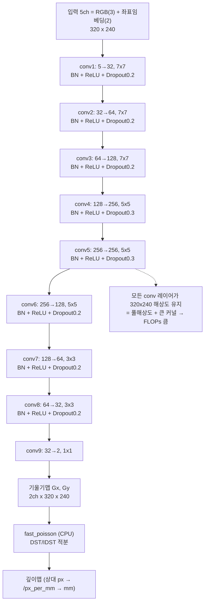
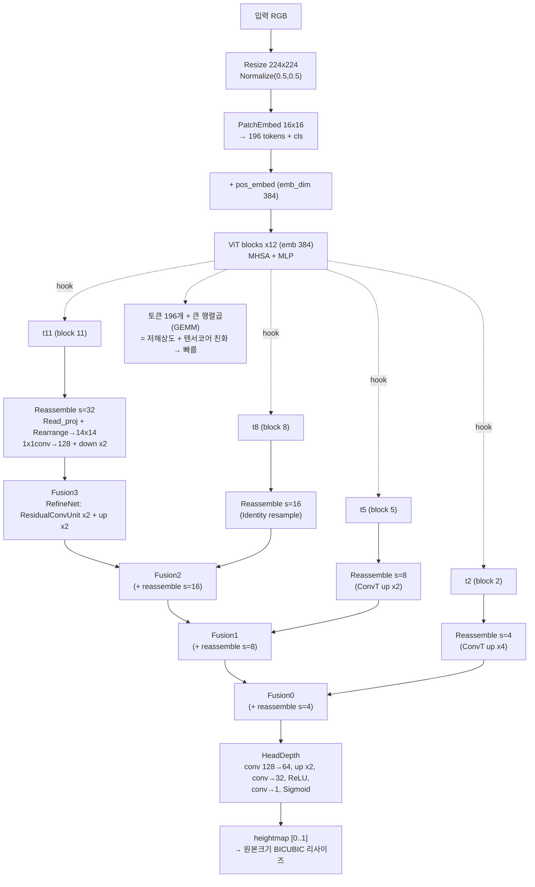

# TouchNet(CNN) vs DPT(ViT) 아키텍처 비교

두 촉각 깊이 추정 모델의 구조를 비교합니다. (코드 기준: TouchNet = `py3DCal/model_training/models/touchnet.py`,
DPT = `examples/dpt_lite/` = NeuralFeels tactile transformer 복사본)

GitHub 의 마크다운 뷰어에서 아래 Mermaid 다이어그램이 그대로 렌더링됩니다.

---

## 1) TouchNet — Fully-Convolutional CNN

- 입력: **5채널** (RGB 3 + 좌표 임베딩 2), DIGIT 프레임 **320×240 풀해상도**
- 9개 conv 블록 내내 **다운샘플 없음**(padding 으로 해상도 유지), 큰 커널(7×7 → 5×5 → 3×3)
- 출력: **2채널 표면 기울기**(Gx, Gy) → 모델 밖에서 **Poisson 적분(CPU)** 으로 깊이맵 생성
- 파라미터 약 **3.9M**

---

## 2) DPT — Dense Prediction Transformer (ViT-small/16)

- 입력: RGB → **224×224 리사이즈** + Normalize(0.5, 0.5)
- timm `vit_small_patch16_224`: patch16 → **14×14 = 196 토큰** (+cls), emb_dim **384**, 블록 **12개**
- **hook @ 블록 2·5·8·11** 에서 중간 토큰 특징 추출 → 4개 스케일 **Reassemble** → **Fusion(top-down RefineNet)** → **HeadDepth**
- 출력: **heightmap [0..1]** (Sigmoid) → 원본 크기로 BICUBIC 리사이즈
- 파라미터 약 **25.9M** (대부분 ViT 인코더)

---

## 3) 비교 요약

| 항목 | TouchNet (CNN) | DPT (ViT) |
|------|----------------|-----------|
| 기본 연산 | 2D Convolution (7×7/5×5/3×3) | Self-Attention + MLP (GEMM) |
| 입력 | 5ch (RGB + 좌표임베딩), **320×240** | RGB **224×224** |
| 내부 해상도 | 전 레이어 **320×240 유지** (다운샘플 없음) | patch16 → **14×14 토큰** (≈8.6× 다운샘플) |
| 깊이 산출 | 기울기(Gx,Gy) → **Poisson 적분(CPU)** | heightmap 직접 출력(Sigmoid) |
| blank 처리 | 입력에서 blank 차감(필수) | heightmap − blank_heightmap |
| 파라미터 | 약 **3.9M** | 약 **25.9M** |
| 출력 단위 | 상대 px → `px_per_mm` 로 **mm** | 상대값 [0..255] Δheightmap |
| 추론 속도(4070, FP16) | 느림 (~20–25 fps, 49 ms) | 빠름 (~80–120 fps, ~12 ms) |
| 가중치 | Zenodo `digit_pretrained_weights.pth` | HF `dpt_real.p` / `dpt_sim.p` |

**왜 파라미터가 많은 DPT 가 더 빠른가?**
TouchNet 은 적은 파라미터를 **320×240 풀해상도 + 큰 커널 conv** 로 9겹 반복 적용해 FLOPs·메모리대역폭이 크고, 끝에 **CPU Poisson 적분**이 붙습니다.
DPT 는 입력을 196토큰으로 **압축**한 뒤 거의 전부 **행렬곱(GEMM)** 이라 **FP16 텐서코어**에 잘 매핑되어 빠릅니다.
자세한 속도 분석은 [`README.md`](README.md) 의 "왜 이런 결과가 나오는가 — 속도 분석" 절을 참고하세요.

> 비교 실행: `examples/stream_compare_touchnet_dpt.py` (실시간 3-way 비교), `examples/benchmark_touchnet_dpt.sh` (속도 벤치마크).
